# Deploy Your AI Application in Production

[](https://opensource.org/licenses/MIT)
[](https://azure.microsoft.com)
[](https://azure.microsoft.com/en-us/products/ai-foundry/)
[](https://codespaces.new/Zone-Enterprise/Deploy-Your-AI-Application-In-Production)

## 🚀 Overview

> **✨ New: Updated deployment to match Foundry release at Build 2025!**  
> Successfully tested in the EastUS2 region with enhanced security and monitoring capabilities.

This is a **production-ready solution** for deploying Azure AI Foundry with comprehensive network isolation, security controls, and monitoring. Built following Microsoft's Well-Architected Framework (WAF), this solution helps organizations transition from proof-of-concept to production-grade AI applications.

### What This Solution Provides

```mermaid
graph LR
    subgraph "🎯 Key Benefits"
        A[🔒 Network Isolation]
        B[🤖 AI Foundry Ready]
        C[📊 Production Monitoring]
        D[🛡️ Enterprise Security]
    end
    
    subgraph "🏗️ Infrastructure"
        E[Virtual Network]
        F[Private Endpoints]
        G[Azure Bastion]
        H[Jump Box VM]
    end
    
    subgraph "🤖 AI Services"
        I[AI Foundry Hub]
        J[AI Projects]
        K[Azure OpenAI]
        L[AI Search]
    end
    
    subgraph "📊 Optional Services"
        M[Cosmos DB]
        N[SQL Server]
        O[API Management]
        P[App Service]
    end
    
    A --> E
    B --> I
    C --> E
    D --> F
    
    classDef benefit fill:#e3f2fd,stroke:#1976d2,stroke-width:2px
    classDef infra fill:#e8f5e8,stroke:#388e3c,stroke-width:2px
    classDef ai fill:#fff3e0,stroke:#f57c00,stroke-width:2px
    classDef optional fill:#f3e5f5,stroke:#7b1fa2,stroke-width:2px
    
    class A,B,C,D benefit
    class E,F,G,H infra
    class I,J,K,L ai
    class M,N,O,P optional
```



### 🎯 Key Features

- **🔐 Zero Trust Architecture**: Complete network isolation with private endpoints
- **🤖 AI-Ready Infrastructure**: Pre-configured AI Foundry Hub and Projects
- **📊 Production Monitoring**: Comprehensive logging and alerting
- **🚀 Quick Deployment**: Multiple deployment options (Codespaces, local, CI/CD)
- **🛡️ Enterprise Security**: Azure AD integration, RBAC, and Key Vault
- **📈 Scalable Design**: Built for production workloads with monitoring
- **🔧 Customizable**: Optional services based on your requirements

### 📋 What Gets Deployed

This solution automatically configures:

1. **🌐 Secure Network Foundation**
   - Virtual network with proper segmentation
   - Private endpoints for all Azure services
   - Azure Bastion for secure access
   - Network security groups and rules

2. **🤖 AI Services Stack**
   - AI Foundry Hub with network isolation
   - AI Foundry Project with service connections
   - Azure OpenAI with GPT-4o and embedding models
   - Optional: AI Search, Content Safety, Vision, Speech

3. **📊 Data & Storage Services**
   - Secure storage accounts with private access
   - Key Vault for secrets management
   - Container Registry for custom images
   - Optional: Cosmos DB, SQL Server

4. **🔍 Monitoring & Management**
   - Log Analytics workspace
   - Application Insights for performance monitoring
   - Diagnostic settings for all services
   - Optional: API Management gateway 


## 🏗️ Architecture Overview

The solution implements a secure, production-ready architecture with complete network isolation and comprehensive monitoring.

### High-Level Architecture

```mermaid
graph TB
    subgraph "🌐 Azure Subscription"
        subgraph "📦 Resource Group"
            subgraph "🔒 Virtual Network (10.0.0.0/16)"
                subgraph "🖥️ Default Subnet (10.0.0.0/24)"
                    VM[Jump Box VM]
                    PE[🔗 Private Endpoints]
                end
                subgraph "🚪 Bastion Subnet (10.0.1.0/27)"
                    BAS[Azure Bastion]
                end
                subgraph "🌐 Web Apps Subnet (10.0.2.0/24)"
                    APP[Sample App Service]
                end
            end
            
            subgraph "🤖 AI Services"
                AIF[AI Foundry Hub]
                AIP[AI Foundry Project]
                AOI[Azure OpenAI]
            end
            
            subgraph "💾 Data Services"
                ST[Storage Account]
                KV[🔐 Key Vault]
                ACR[📦 Container Registry]
                COS[🍃 Cosmos DB]
                SQL[🗄️ SQL Server]
                AIS[🔍 AI Search]
            end
            
            subgraph "📊 Management"
                APIM[API Management]
                LAW[📊 Log Analytics]
                AI[📈 App Insights]
            end
        end
    end
    
    USER[👤 User] -->|HTTPS:443| BAS
    BAS -->|RDP:3389| VM
    VM --> PE
    PE -.->|Private| AIF
    PE -.->|Private| ST
    PE -.->|Private| KV
    PE -.->|Private| ACR
    AIF --> AIP
    AIP --> AOI
    APP --> APIM
    APIM --> AIP
    
    classDef user fill:#e3f2fd,stroke:#1976d2,stroke-width:3px
    classDef network fill:#e8f5e8,stroke:#388e3c,stroke-width:2px
    classDef ai fill:#fff3e0,stroke:#f57c00,stroke-width:2px
    classDef data fill:#e1f5fe,stroke:#0277bd,stroke-width:2px
    classDef mgmt fill:#f3e5f5,stroke:#7b1fa2,stroke-width:2px
    
    class USER user
    class VM,BAS,PE,APP network
    class AIF,AIP,AOI ai
    class ST,KV,ACR,COS,SQL,AIS data
    class APIM,LAW,AI mgmt
```



### Security Architecture Flow

| Step | Component | Description |
|------|-----------|-------------|
| 1 | 🔐 **Authentication** | Users authenticate via Azure AD with MFA to access Azure Bastion |
| 2 | 🚪 **Secure Access** | Azure Bastion provides secure RDP access to jump box VM without public IP |
| 3 | 🔗 **Private Connectivity** | All Azure services accessible only through private endpoints within VNet |
| 4 | 🤖 **AI Services** | AI Foundry Hub and Projects secured with Azure AD and private endpoints |
| 5 | 🛡️ **API Gateway** | API Management in private mode handles cross-cutting concerns securely |

### Network Isolation Details


> 📖 **For comprehensive technical details**, see our [Technical Architecture Documentation](docs/TECHNICAL_ARCHITECTURE.md)

## ✨ Key Features & Capabilities

### 🚀 Production-Ready AI Infrastructure
- **AI Foundry Hub & Projects**: Latest Azure AI Foundry with Build 2025 updates
- **Azure OpenAI Integration**: Pre-configured with GPT-4o and text-embedding models
- **Network Isolation**: Complete private endpoint architecture for security
- **Zero Trust Architecture**: No public internet access to AI services

### 🔒 Enterprise Security
- **Azure AD Integration**: Multi-factor authentication and conditional access
- **Private Endpoints**: All services accessible only within the virtual network
- **Key Vault Integration**: Secure secrets and certificate management
- **Role-Based Access Control**: Granular permissions for different user roles

### 📊 Monitoring & Observability
- **Comprehensive Logging**: All services configured with diagnostic settings
- **Performance Monitoring**: Application Insights for real-time performance tracking
- **Security Monitoring**: Network security group logs and security alerts
- **Cost Optimization**: Built-in cost monitoring and optimization recommendations

### 🔧 Flexible Configuration
- **Optional Services**: Choose from AI Search, Cosmos DB, SQL Server, API Management
- **Custom Models**: Support for custom AI model deployments
- **Existing Project Integration**: Import connections from existing AI Foundry projects
- **Sample Application**: Optional chat application for testing and demonstration

### 📈 Scalability & Performance
- **Auto-scaling**: Built-in scaling for compute and storage resources
- **High Availability**: Multi-zone deployment options for critical workloads
- **Performance Optimization**: Optimized network routing and caching
- **Load Balancing**: API Management for intelligent request routing

### 🛠️ Developer Experience
- **Multiple Deployment Options**: GitHub Codespaces, local environment, or CI/CD
- **Infrastructure as Code**: Complete Bicep templates for reproducible deployments
- **Documentation**: Comprehensive guides and troubleshooting resources
- **Testing Framework**: Built-in validation and testing capabilities


## 📋 Prerequisites & Requirements

### 🔑 Azure Requirements


### Essential Prerequisites

1. **🔐 Azure Access**
   - Azure subscription with Contributor permissions
   - Azure AD account with appropriate roles
   - [Required roles and scopes configured](docs/Required_roles_scopes_resources.md)

2. **🌍 Region & Quota Planning**
   - Check [Azure OpenAI quota availability](docs/quota_check.md)
   - Select appropriate Azure region ([see availability guide](https://learn.microsoft.com/azure/ai-services/openai/concepts/models#standard-deployment-model-availability))
   - Ensure sufficient quota for GPT-4o and embedding models

3. **🔧 Network Access**
   - **Important**: The solution creates a jump-box VM with Azure Bastion for secure access
   - Optionally specify your IP address in `allowedIpAddress` parameter for additional security
   - Default configuration allows all IPs to connect to Azure Bastion

### 🧪 Check Azure OpenAI Quota

Before deployment, verify sufficient quota availability:

📊 **[Follow the quota check guide](docs/quota_check.md)** to ensure your subscription has:
- GPT-4o model quota (minimum 150 tokens per minute)
- Text-embedding-3-small quota (minimum 100 tokens per minute)

### 🌍 Supported Azure Regions

**Recommended Regions** (tested and verified):
- `East US 2` ✅ (Primary test region)
- `West US 2` ✅
- `West Europe` ✅
- `UK South` ✅

> 💡 **Tip**: Use the [Azure region selector tool](https://azure.microsoft.com/global-infrastructure/services/) to find the best region for your requirements.

### 🛠️ Development Environment Options

| Environment | Requirements | Setup Time |
|-------------|--------------|------------|
| **☁️ GitHub Codespaces** | GitHub Team/Enterprise account | ~2 minutes |
| **💻 Local Development** | Azure CLI + Azure Developer CLI | ~10 minutes |
| **🔄 CI/CD Pipeline** | GitHub Actions workflow | ~15 minutes |

### 🎯 Optional Components

Enable additional services based on your requirements:

- **🔍 AI Search**: For advanced search capabilities
- **🍃 Cosmos DB**: For NoSQL data storage
- **🗄️ SQL Server**: For relational data storage
- **🚪 API Management**: For API gateway functionality
- **📱 Sample Application**: For testing and demonstration

Each optional service can be enabled during deployment by setting the corresponding feature flags.

## 🔧 Included Azure Services

### Core Infrastructure Services

```mermaid
graph TB
    subgraph "🏗️ Foundation Services"
        VN[Virtual Network<br/>Network Segmentation]
        BAS[Azure Bastion<br/>Secure Access]
        VM[Jump Box VM<br/>Management Access]
        KV[Key Vault<br/>Secrets Management]
    end
    
    subgraph "🤖 AI & Cognitive Services"
        AIF[AI Foundry Hub<br/>Central AI Hub]
        AIP[AI Foundry Project<br/>Workspace]
        AOI[Azure OpenAI<br/>GPT-4o + Embeddings]
        AIS[AI Search<br/>Optional]
        CS[Content Safety<br/>Optional]
        VIS[AI Vision<br/>Optional]
        SPE[AI Speech<br/>Optional]
        TRA[Translator<br/>Optional]
        DOC[Document Intelligence<br/>Optional]
    end
    
    subgraph "💾 Data & Storage"
        ST[Storage Account<br/>Blob + File Storage]
        ACR[Container Registry<br/>Premium Tier]
        COS[Cosmos DB<br/>Optional NoSQL]
        SQL[SQL Server<br/>Optional RDBMS]
    end
    
    subgraph "📊 Monitoring & Management"
        LAW[Log Analytics<br/>Centralized Logging]
        AI[Application Insights<br/>Performance Monitoring]
        APIM[API Management<br/>Optional Gateway]
        APP[App Service<br/>Optional Sample App]
    end
    
    classDef foundation fill:#e8eaf6,stroke:#3f51b5,stroke-width:2px
    classDef ai fill:#fff3e0,stroke:#ef6c00,stroke-width:2px
    classDef data fill:#e1f5fe,stroke:#0277bd,stroke-width:2px
    classDef monitor fill:#f3e5f5,stroke:#7b1fa2,stroke-width:2px
    
    class VN,BAS,VM,KV foundation
    class AIF,AIP,AOI,AIS,CS,VIS,SPE,TRA,DOC ai
    class ST,ACR,COS,SQL data
    class LAW,AI,APIM,APP monitor
```



### Service Details & Documentation

| Service Category | Service | Purpose | Documentation |
|------------------|---------|---------|---------------|
| **🤖 AI Services** | Azure AI Foundry Hub | Central hub for AI projects | [Learn More](https://learn.microsoft.com/en-us/azure/ai-foundry/) |
| | Azure AI Foundry Project | Individual AI project workspace | [Learn More](https://learn.microsoft.com/en-us/azure/ai-foundry/) |
| | Azure OpenAI | Large language models (GPT-4o, embeddings) | [Learn More](https://learn.microsoft.com/en-us/azure/ai-services/openai/) |
| | Azure AI Search | Cognitive search capabilities | [Learn More](https://learn.microsoft.com/en-us/azure/search/) |
| **🏗️ Infrastructure** | Virtual Network | Network isolation and segmentation | [Learn More](https://learn.microsoft.com/en-us/azure/virtual-network/) |
| | Azure Bastion | Secure RDP/SSH access | [Learn More](https://learn.microsoft.com/en-us/azure/bastion/) |
| | Virtual Machines | Jump box for secure access | [Learn More](https://learn.microsoft.com/en-us/azure/virtual-machines/) |
| **💾 Storage** | Storage Account | Blob and file storage | [Learn More](https://learn.microsoft.com/en-us/azure/storage/) |
| | Container Registry | Private container images | [Learn More](https://learn.microsoft.com/en-us/azure/container-registry/) |
| | Key Vault | Secrets and certificate management | [Learn More](https://learn.microsoft.com/en-us/azure/key-vault/) |
| **📊 Monitoring** | Log Analytics | Centralized logging platform | [Learn More](https://learn.microsoft.com/en-us/azure/azure-monitor/logs/log-analytics-overview) |
| | Application Insights | Application performance monitoring | [Learn More](https://learn.microsoft.com/en-us/azure/azure-monitor/app/app-insights-overview) |

### Optional Services (Configurable)

These services can be enabled during deployment based on your requirements:

- **🍃 Cosmos DB**: NoSQL database for scalable applications
- **🗄️ SQL Server**: Relational database for structured data
- **🚪 API Management**: Enterprise API gateway and management
- **📱 App Service**: Hosting for the sample chat application
- **🛡️ Content Safety**: AI content moderation and safety
- **👁️ AI Vision**: Computer vision and image analysis
- **🗣️ AI Speech**: Speech-to-text and text-to-speech
- **🌐 Translator**: Multi-language translation services
- **📄 Document Intelligence**: Document processing and analysis

## 🚀 Quick Start

### Deployment Options

Choose your preferred deployment method:

```mermaid
graph LR
    subgraph "🚀 Quick Deploy Options"
        A[☁️ GitHub Codespaces<br/>Recommended]
        B[💻 Local Environment<br/>Azure CLI + AZD]
        C[🔄 GitHub Actions<br/>CI/CD Pipeline]
    end
    
    A --> D[🎯 Deploy Infrastructure]
    B --> D
    C --> D
    
    D --> E[✅ Verify Deployment]
    E --> F[🤖 Deploy AI Application]
    F --> G[📊 Monitor & Manage]
    
    classDef option fill:#e3f2fd,stroke:#1976d2,stroke-width:2px
    classDef process fill:#e8f5e8,stroke:#388e3c,stroke-width:2px
    
    class A,B,C option
    class D,E,F,G process
```



### Option 1: GitHub Codespaces (Recommended)

<h3> Quick Deploy with Codespaces</h3>

| Deploy Now | Setup Guide |
|------------|-------------|
| [](https://codespaces.new/Zone-Enterprise/Deploy-Your-AI-Application-In-Production) | [📖 Codespaces Setup Guide](docs/github_code_spaces_steps.md) |

### Option 2: Local Environment

```bash
# Install prerequisites
az --version  # Azure CLI
azd --version # Azure Developer CLI

# Clone and deploy
git clone https://github.com/Zone-Enterprise/Deploy-Your-AI-Application-In-Production.git
cd Deploy-Your-AI-Application-In-Production
azd up
```

📖 [Complete Local Setup Guide](docs/local_environment_steps.md)

### Option 3: GitHub Actions

Set up automated deployment with GitHub Actions for production environments.

📖 [GitHub Actions Setup Guide](docs/github_actions_steps.md)


## 🎯 Post-Deployment Guide

### Deployment Verification

After successful deployment, follow these steps to verify and configure your environment:

```mermaid
graph LR
    A[✅ Deployment Complete] --> B[🔍 Verify Network Isolation]
    B --> C[🔗 Connect via Bastion]
    C --> D[🤖 Access AI Foundry]
    D --> E[📊 Configure Monitoring]
    E --> F[🚀 Deploy Applications]
    
    classDef complete fill:#e8f5e8,stroke:#388e3c,stroke-width:2px
    classDef verify fill:#e3f2fd,stroke:#1976d2,stroke-width:2px
    classDef configure fill:#fff3e0,stroke:#f57c00,stroke-width:2px
    
    class A complete
    class B,C,D verify
    class E,F configure
```



### 1. 🔍 Verify Network Isolation

Confirm that your environment is properly secured:

```bash
# Check private endpoint status
az network private-endpoint list --resource-group <your-rg-name>

# Verify network isolation
az cognitiveservices account show --name <your-ai-foundry-name> --resource-group <your-rg-name>
```

📖 **[Complete Network Verification Guide](docs/github_code_spaces_steps.md)**

### 2. 🔗 Connect to Isolated Environment

Access your secure environment through Azure Bastion:

1. Navigate to Azure Portal → Your Resource Group → Jump Box VM
2. Click "Connect" → "Bastion"
3. Enter your VM credentials (configured during deployment)
4. Access AI Foundry and other services from within the secure network

### 3. 🚀 Deploy Sample Application (Optional)

If you enabled the sample application during deployment:

📖 **[Sample Application Setup Guide](docs/sample_app_setup.md)**

### 4. 🤖 Deploy Your AI Application

Start building your production AI application:

1. **Configure AI Foundry Project**
   - Set up model deployments
   - Configure data connections
   - Set up prompt flows

2. **Deploy to Secure Environment**
   - Use the provided App Service infrastructure
   - Configure private connectivity
   - Set up monitoring and alerting

📖 **[AI Application Deployment Guide](docs/deploy_your_application.md)**

## 📚 Advanced Configuration

### 🔧 Customize Your Deployment

- **[Add Additional Services](docs/add_additional_services.md)**: Enable Cosmos DB, SQL Server, or API Management
- **[Transfer Existing Projects](docs/transfer_project_connections.md)**: Import from existing AI Foundry projects
- **[Modify AI Models](docs/modify_deployed_models.md)**: Change or add AI model deployments
- **[Reuse Log Analytics](docs/re-use-log-analytics.md)**: Connect to existing monitoring infrastructure

### 🔍 Monitoring & Operations

- **[Verify Services](docs/Verify_Services_On_Network.md)**: Comprehensive service validation
- **[Post-Deployment Steps](docs/post_deployment_steps.md)**: Complete configuration checklist
- **[Technical Architecture](docs/TECHNICAL_ARCHITECTURE.md)**: Detailed technical documentation

## 💡 Best Practices & Guidance

### 🌍 Regional Considerations

Choose your deployment region based on:
- **AI Model Availability**: Ensure your target models are available
- **Data Residency**: Comply with organizational data requirements
- **Latency Requirements**: Choose regions close to your users
- **Cost Optimization**: Consider regional pricing differences

📊 **[Check Region Availability](https://learn.microsoft.com/azure/ai-services/openai/concepts/models#standard-deployment-model-availability)**

### 💰 Cost Management

Estimate and optimize your costs:

- **[Azure Pricing Calculator](https://azure.microsoft.com/pricing/calculator/)**: Get cost estimates
- **Cost Optimization Tips**:
  - Use appropriate VM sizes for your workload
  - Consider Azure Reserved Instances for long-term deployments
  - Monitor and optimize AI model usage
  - Use auto-scaling for variable workloads

### 🔒 Security Best Practices

- **Regular Security Reviews**: Monitor security alerts and recommendations
- **Access Management**: Regularly review and update RBAC assignments
- **Secret Rotation**: Implement regular rotation for keys and certificates
- **Network Monitoring**: Monitor network traffic and access patterns

### 📈 Performance Optimization

- **Model Selection**: Choose appropriate AI models for your use case
- **Caching Strategy**: Implement caching for frequently accessed data
- **Load Testing**: Test your application under expected load
- **Monitoring**: Set up comprehensive monitoring and alerting

## 📖 Resources & Documentation

### 🎓 Learning Resources

| Resource | Description |
|----------|-------------|
| [Azure AI Foundry Documentation](https://learn.microsoft.com/en-us/azure/ai-foundry/) | Complete guide to Azure AI Foundry |
| [Azure Well-Architected Framework](https://learn.microsoft.com/en-us/azure/well-architected/) | Best practices for cloud architecture |
| [Azure OpenAI Service](https://learn.microsoft.com/en-us/azure/ai-services/openai/concepts/use-your-data) | OpenAI integration and usage |
| [Azure AI Content Understanding](https://learn.microsoft.com/en-us/azure/ai-services/content-understanding/) | Content processing capabilities |

### 🛠️ Technical Documentation

- **[Technical Architecture](docs/TECHNICAL_ARCHITECTURE.md)**: Comprehensive technical details and Mermaid diagrams
- **[Network Configuration](docs/Verify_Services_On_Network.md)**: Network isolation and security details
- **[Service Integration](docs/add_additional_services.md)**: Adding and configuring optional services

### 🔧 Operational Guides

- **[Quota Management](docs/quota_check.md)**: Azure OpenAI quota requirements and management
- **[Required Roles & Scopes](docs/Required_roles_scopes_resources.md)**: Prerequisites and permissions
- **[Post-Deployment Steps](docs/post_deployment_steps.md)**: Complete configuration checklist

### 🤝 Community & Support

- **[Contributing Guidelines](CONTRIBUTING.md)**: How to contribute to this project
- **[Code of Conduct](CODE_OF_CONDUCT.md)**: Community guidelines
- **[Security Policy](SECURITY.md)**: Security reporting and policies
- **[Support](SUPPORT.md)**: Getting help and support

---

## 📄 Legal & Compliance

### 📝 Disclaimers

**Important Legal Information**: This solution is provided as-is for educational and demonstration purposes. Please review all disclaimers and compliance requirements before production use.

- **Microsoft Products and Services**: Compliance with Product Terms required for Microsoft Azure Services
- **Export Control**: Subject to domestic and international export laws and regulations
- **Medical Use**: Not designed as a medical device or substitute for professional medical advice
- **High-Risk Use**: Not intended for use where failure could result in injury or damage
- **SOC Compliance**: Not subject to SOC 1 and SOC 2 compliance audits
- **Financial Services**: Not a substitute for professional financial advice

### 🔒 Data Collection & Privacy

This software may collect information about usage and send it to Microsoft. Key points:

- **Telemetry**: Can be disabled (see repository documentation)
- **User Data**: Features may enable data collection from application users
- **Compliance**: Must comply with applicable laws and provide appropriate notices
- **Privacy Statement**: Available at https://go.microsoft.com/fwlink/?LinkID=824704

### ⚖️ License & Usage

- **License**: MIT License (see [LICENSE](LICENSE) file)
- **Trademarks**: Microsoft trademarks subject to Microsoft guidelines
- **Third-party**: Third-party trademarks subject to respective policies
- **Usage**: Authorized use must follow all applicable guidelines

**By using this software, you acknowledge and agree to these terms and conditions.**

---

## 🏷️ Version Information

| Version | Date | Changes |
|---------|------|---------|
| **1.2** | 2025-05-13 | AI Foundry Build 2025 updates, new project module, enhanced security |
| **1.1** | 2025-04-30 | Connection transfer feature, improved documentation |
| **1.0** | 2025-03-10 | Initial release with core functionality |

📋 **[View Complete Changelog](CHANGELOG.md)**

---

<div align="center">

### 🌟 Ready to Deploy Your AI Application?

[](https://codespaces.new/Zone-Enterprise/Deploy-Your-AI-Application-In-Production)

[](docs/TECHNICAL_ARCHITECTURE.md)
[](https://azure.microsoft.com/pricing/calculator/)

**Built with ❤️ by the Azure AI Team**

</div>

## Disclaimers

To the extent that the Software includes components or code used in or derived from Microsoft products or services, including without limitation Microsoft Azure Services (collectively, “Microsoft Products and Services”), you must also comply with the Product Terms applicable to such Microsoft Products and Services. You acknowledge and agree that the license governing the Software does not grant you a license or other right to use Microsoft Products and Services. Nothing in the license or this ReadMe file will serve to supersede, amend, terminate or modify any terms in the Product Terms for any Microsoft Products and Services. 

You must also comply with all domestic and international export laws and regulations that apply to the Software, which include restrictions on destinations, end users, and end use. For further information on export restrictions, visit https://aka.ms/exporting. 

You acknowledge that the Software and Microsoft Products and Services (1) are not designed, intended or made available as a medical device(s), and (2) are not designed or intended to be a substitute for professional medical advice, diagnosis, treatment, or judgment and should not be used to replace or as a substitute for professional medical advice, diagnosis, treatment, or judgment. Customer is solely responsible for displaying and/or obtaining appropriate consents, warnings, disclaimers, and acknowledgements to end users of Customer’s implementation of the Online Services. 

You acknowledge the Software is not subject to SOC 1 and SOC 2 compliance audits. No Microsoft technology, nor any of its component technologies, including the Software, is intended or made available as a substitute for the professional advice, opinion, or judgement of a certified financial services professional. Do not use the Software to replace, substitute, or provide professional financial advice or judgment.  

BY ACCESSING OR USING THE SOFTWARE, YOU ACKNOWLEDGE THAT THE SOFTWARE IS NOT DESIGNED OR INTENDED TO SUPPORT ANY USE IN WHICH A SERVICE INTERRUPTION, DEFECT, ERROR, OR OTHER FAILURE OF THE SOFTWARE COULD RESULT IN THE DEATH OR SERIOUS BODILY INJURY OF ANY PERSON OR IN PHYSICAL OR ENVIRONMENTAL DAMAGE (COLLECTIVELY, “HIGH-RISK USE”), AND THAT YOU WILL ENSURE THAT, IN THE EVENT OF ANY INTERRUPTION, DEFECT, ERROR, OR OTHER FAILURE OF THE SOFTWARE, THE SAFETY OF PEOPLE, PROPERTY, AND THE ENVIRONMENT ARE NOT REDUCED BELOW A LEVEL THAT IS REASONABLY, APPROPRIATE, AND LEGAL, WHETHER IN GENERAL OR IN A SPECIFIC INDUSTRY. BY ACCESSING THE SOFTWARE, YOU FURTHER ACKNOWLEDGE THAT YOUR HIGH-RISK USE OF THE SOFTWARE IS AT YOUR OWN RISK.  

* Data Collection. The software may collect information about you and your use of the software and send it to Microsoft. Microsoft may use this information to provide services and improve our products and services. You may turn off the telemetry as described in the repository. There are also some features in the software that may enable you and Microsoft to collect data from users of your applications. If you use these features, you must comply with applicable law, including providing appropriate notices to users of your applications together with a copy of Microsoft’s privacy statement. Our privacy statement is located at https://go.microsoft.com/fwlink/?LinkID=824704. You can learn more about data collection and use in the help documentation and our privacy statement. Your use of the software operates as your consent to these practices.
