# Deployment Flow Diagrams

This document provides comprehensive deployment flow diagrams for the AI Foundry infrastructure and applications.

## Infrastructure Deployment Flow

### Complete Deployment Process


## Service Deployment Dependencies


## Application Deployment Pipeline

```mermaid
graph TB
    subgraph "Source Control"
        REPO[📁 Git Repository]
        FEATURE[🌿 Feature Branch]
        MAIN[🌲 Main Branch]
    end
    
    subgraph "CI Pipeline"
        TRIGGER[🔔 Pipeline Trigger]
        BUILD[🔨 Build Application]
        TEST[🧪 Run Tests]
        SCAN[🔒 Security Scan]
        PACKAGE[📦 Package Artifacts]
    end
    
    subgraph "Infrastructure Validation"
        BICEP_VALIDATE[✅ Validate Bicep]
        WHATIF[🔍 What-If Analysis]
        TEMPLATE_TEST[🧪 Template Testing]
    end
    
    subgraph "CD Pipeline - Dev"
        DEPLOY_INFRA_DEV[🏗️ Deploy Infrastructure]
        DEPLOY_APP_DEV[📱 Deploy Application]
        SMOKE_TEST_DEV[💨 Smoke Tests]
    end
    
    subgraph "CD Pipeline - Staging"
        DEPLOY_INFRA_STAGING[🏗️ Deploy Infrastructure]
        DEPLOY_APP_STAGING[📱 Deploy Application]
        E2E_TEST[🔄 E2E Tests]
        PERF_TEST[⚡ Performance Tests]
        SECURITY_TEST[🛡️ Security Tests]
    end
    
    subgraph "CD Pipeline - Production"
        APPROVAL[👤 Manual Approval]
        DEPLOY_INFRA_PROD[🏗️ Deploy Infrastructure]
        BLUE_GREEN[🔄 Blue-Green Deployment]
        HEALTH_CHECK[❤️ Health Check]
        ROLLBACK[↩️ Rollback (if needed)]
    end
    
    %% Flow
    REPO --> FEATURE
    FEATURE --> TRIGGER
    TRIGGER --> BUILD
    BUILD --> TEST
    TEST --> SCAN
    SCAN --> PACKAGE
    
    PACKAGE --> BICEP_VALIDATE
    BICEP_VALIDATE --> WHATIF
    WHATIF --> TEMPLATE_TEST
    
    TEMPLATE_TEST --> DEPLOY_INFRA_DEV
    DEPLOY_INFRA_DEV --> DEPLOY_APP_DEV
    DEPLOY_APP_DEV --> SMOKE_TEST_DEV
    
    SMOKE_TEST_DEV --> DEPLOY_INFRA_STAGING
    DEPLOY_INFRA_STAGING --> DEPLOY_APP_STAGING
    DEPLOY_APP_STAGING --> E2E_TEST
    E2E_TEST --> PERF_TEST
    PERF_TEST --> SECURITY_TEST
    
    SECURITY_TEST --> APPROVAL
    APPROVAL --> DEPLOY_INFRA_PROD
    DEPLOY_INFRA_PROD --> BLUE_GREEN
    BLUE_GREEN --> HEALTH_CHECK
    HEALTH_CHECK -->|Failure| ROLLBACK
    HEALTH_CHECK -->|Success| COMPLETE_DEPLOY[✅ Deployment Complete]
    
    FEATURE -->|PR Merged| MAIN
    MAIN --> TRIGGER
    
    classDef source fill:#e8f5e8,stroke:#388e3c,stroke-width:2px
    classDef ci fill:#e3f2fd,stroke:#1976d2,stroke-width:2px
    classDef validate fill:#fff3e0,stroke:#f57c00,stroke-width:2px
    classDef dev fill:#f3e5f5,stroke:#7b1fa2,stroke-width:2px
    classDef staging fill:#e0f2f1,stroke:#00695c,stroke-width:2px
    classDef prod fill:#ffebee,stroke:#d32f2f,stroke-width:2px
    
    class REPO,FEATURE,MAIN source
    class TRIGGER,BUILD,TEST,SCAN,PACKAGE ci
    class BICEP_VALIDATE,WHATIF,TEMPLATE_TEST validate
    class DEPLOY_INFRA_DEV,DEPLOY_APP_DEV,SMOKE_TEST_DEV dev
    class DEPLOY_INFRA_STAGING,DEPLOY_APP_STAGING,E2E_TEST,PERF_TEST,SECURITY_TEST staging
    class APPROVAL,DEPLOY_INFRA_PROD,BLUE_GREEN,HEALTH_CHECK,ROLLBACK,COMPLETE_DEPLOY prod
```

## Monitoring and Alerting Flow

```mermaid
graph TB
    subgraph "Data Sources"
        APP_METRICS[📱 Application Metrics]
        INFRA_METRICS[🏗️ Infrastructure Metrics]
        LOG_DATA[📋 Log Data]
        SECURITY_EVENTS[🔒 Security Events]
        USER_EVENTS[👤 User Events]
    end
    
    subgraph "Collection Layer"
        APP_INSIGHTS[📊 Application Insights]
        AZURE_MONITOR[📈 Azure Monitor]
        LOG_ANALYTICS[📋 Log Analytics]
        SECURITY_CENTER[🛡️ Security Center]
    end
    
    subgraph "Processing Layer"
        QUERIES[🔍 KQL Queries]
        AGGREGATION[📊 Data Aggregation]
        ML_DETECTION[🤖 ML Anomaly Detection]
        CORRELATION[🔗 Event Correlation]
    end
    
    subgraph "Alerting Layer"
        ALERT_RULES[⚠️ Alert Rules]
        ACTION_GROUPS[👥 Action Groups]
        SMART_GROUPS[🧠 Smart Groups]
    end
    
    subgraph "Notification Channels"
        EMAIL[📧 Email]
        SMS[📱 SMS]
        TEAMS[💬 Microsoft Teams]
        WEBHOOK[🔗 Webhooks]
        LOGIC_APPS[⚡ Logic Apps]
    end
    
    subgraph "Response Actions"
        AUTO_SCALE[📈 Auto Scale]
        RESTART[🔄 Service Restart]
        FAILOVER[🔄 Failover]
        INCIDENT[🚨 Incident Creation]
    end
    
    %% Data Flow
    APP_METRICS --> APP_INSIGHTS
    INFRA_METRICS --> AZURE_MONITOR
    LOG_DATA --> LOG_ANALYTICS
    SECURITY_EVENTS --> SECURITY_CENTER
    USER_EVENTS --> APP_INSIGHTS
    
    APP_INSIGHTS --> QUERIES
    AZURE_MONITOR --> AGGREGATION
    LOG_ANALYTICS --> ML_DETECTION
    SECURITY_CENTER --> CORRELATION
    
    QUERIES --> ALERT_RULES
    AGGREGATION --> ALERT_RULES
    ML_DETECTION --> ALERT_RULES
    CORRELATION --> ALERT_RULES
    
    ALERT_RULES --> ACTION_GROUPS
    ACTION_GROUPS --> SMART_GROUPS
    
    SMART_GROUPS --> EMAIL
    SMART_GROUPS --> SMS
    SMART_GROUPS --> TEAMS
    SMART_GROUPS --> WEBHOOK
    SMART_GROUPS --> LOGIC_APPS
    
    ACTION_GROUPS --> AUTO_SCALE
    ACTION_GROUPS --> RESTART
    ACTION_GROUPS --> FAILOVER
    ACTION_GROUPS --> INCIDENT
    
    classDef source fill:#e3f2fd,stroke:#1976d2,stroke-width:2px
    classDef collection fill:#e8f5e8,stroke:#388e3c,stroke-width:2px
    classDef processing fill:#fff3e0,stroke:#f57c00,stroke-width:2px
    classDef alerting fill:#ffebee,stroke:#d32f2f,stroke-width:2px
    classDef notification fill:#f3e5f5,stroke:#7b1fa2,stroke-width:2px
    classDef response fill:#e0f2f1,stroke:#00695c,stroke-width:2px
    
    class APP_METRICS,INFRA_METRICS,LOG_DATA,SECURITY_EVENTS,USER_EVENTS source
    class APP_INSIGHTS,AZURE_MONITOR,LOG_ANALYTICS,SECURITY_CENTER collection
    class QUERIES,AGGREGATION,ML_DETECTION,CORRELATION processing
    class ALERT_RULES,ACTION_GROUPS,SMART_GROUPS alerting
    class EMAIL,SMS,TEAMS,WEBHOOK,LOGIC_APPS notification
    class AUTO_SCALE,RESTART,FAILOVER,INCIDENT response
```



## Security and Compliance Flow

```mermaid
graph TB
    subgraph "Identity & Access Management"
        USER[👤 User]
        AAD[🔐 Azure AD]
        MFA[📱 Multi-Factor Auth]
        RBAC[🛡️ Role-Based Access]
        PIM[👑 Privileged Identity Management]
    end
    
    subgraph "Network Security"
        FIREWALL[🔥 Azure Firewall]
        NSG[🛡️ Network Security Groups]
        PE[🔗 Private Endpoints]
        BASTION[🚪 Azure Bastion]
        VPN[🔒 VPN Gateway]
    end
    
    subgraph "Data Protection"
        ENCRYPTION[🔐 Encryption at Rest]
        TLS[🔒 TLS in Transit]
        KV[🗝️ Key Vault]
        CMK[🔑 Customer Managed Keys]
        BACKUP[💾 Backup & Recovery]
    end
    
    subgraph "Security Monitoring"
        DEFENDER[🛡️ Microsoft Defender]
        SENTINEL[👁️ Azure Sentinel]
        SECURITY_CENTER[🏛️ Security Center]
        LOG_ANALYTICS[📋 Log Analytics]
    end
    
    subgraph "Compliance & Governance"
        POLICY[📋 Azure Policy]
        BLUEPRINT[📐 Azure Blueprints]
        COMPLIANCE[✅ Compliance Manager]
        AUDIT[📊 Audit Logs]
    end
    
    subgraph "Incident Response"
        DETECTION[🔍 Threat Detection]
        INVESTIGATION[🕵️ Investigation]
        CONTAINMENT[🚧 Containment]
        REMEDIATION[🔧 Remediation]
        RECOVERY[↗️ Recovery]
    end
    
    %% Security Flow
    USER --> AAD
    AAD --> MFA
    MFA --> RBAC
    RBAC --> PIM
    
    USER --> BASTION
    BASTION --> NSG
    NSG --> PE
    PE --> FIREWALL
    
    KV --> CMK
    CMK --> ENCRYPTION
    ENCRYPTION --> TLS
    TLS --> BACKUP
    
    DEFENDER --> SENTINEL
    SENTINEL --> SECURITY_CENTER
    SECURITY_CENTER --> LOG_ANALYTICS
    
    POLICY --> BLUEPRINT
    BLUEPRINT --> COMPLIANCE
    COMPLIANCE --> AUDIT
    
    DETECTION --> INVESTIGATION
    INVESTIGATION --> CONTAINMENT
    CONTAINMENT --> REMEDIATION
    REMEDIATION --> RECOVERY
    
    LOG_ANALYTICS --> DETECTION
    SENTINEL --> DETECTION
    
    classDef identity fill:#e3f2fd,stroke:#1976d2,stroke-width:2px
    classDef network fill:#e8f5e8,stroke:#388e3c,stroke-width:2px
    classDef data fill:#fff3e0,stroke:#f57c00,stroke-width:2px
    classDef monitoring fill:#f3e5f5,stroke:#7b1fa2,stroke-width:2px
    classDef governance fill:#e0f2f1,stroke:#00695c,stroke-width:2px
    classDef incident fill:#ffebee,stroke:#d32f2f,stroke-width:2px
    
    class USER,AAD,MFA,RBAC,PIM identity
    class FIREWALL,NSG,PE,BASTION,VPN network
    class ENCRYPTION,TLS,KV,CMK,BACKUP data
    class DEFENDER,SENTINEL,SECURITY_CENTER,LOG_ANALYTICS monitoring
    class POLICY,BLUEPRINT,COMPLIANCE,AUDIT governance
    class DETECTION,INVESTIGATION,CONTAINMENT,REMEDIATION,RECOVERY incident
```



## Disaster Recovery Flow

```mermaid
graph TB
    subgraph "Normal Operations"
        PRIMARY[🏢 Primary Region]
        WORKLOAD[💼 Production Workload]
        DATA[📊 Primary Data]
        USERS[👥 Users]
    end
    
    subgraph "Backup & Replication"
        BACKUP_DATA[💾 Data Backup]
        GEO_BACKUP[🌍 Geo-Redundant Backup]
        REPLICATION[🔄 Active Replication]
        CONFIG_BACKUP[⚙️ Configuration Backup]
    end
    
    subgraph "Disaster Detection"
        MONITORING[📊 Health Monitoring]
        ALERTS[🚨 Disaster Alerts]
        ASSESSMENT[🔍 Impact Assessment]
        DECISION[🤔 Recovery Decision]
    end
    
    subgraph "Recovery Process"
        FAILOVER[🔄 Failover Initiation]
        SECONDARY[🏢 Secondary Region]
        DATA_RESTORE[📊 Data Restoration]
        SERVICE_RESTORE[⚙️ Service Restoration]
        DNS_UPDATE[🌐 DNS Update]
        VALIDATION[✅ Service Validation]
    end
    
    subgraph "Recovery Operations"
        USER_REDIRECT[👥 User Redirection]
        PERFORMANCE_CHECK[⚡ Performance Check]
        DATA_SYNC[🔄 Data Synchronization]
        MONITORING_UPDATE[📊 Monitoring Update]
    end
    
    subgraph "Recovery Completion"
        COMMUNICATION[📢 User Communication]
        POST_MORTEM[📋 Post-Mortem Analysis]
        IMPROVEMENT[📈 Process Improvement]
        DOCUMENTATION[📚 Documentation Update]
    end
    
    %% Normal Flow
    USERS --> WORKLOAD
    WORKLOAD --> DATA
    
    %% Backup Flow
    DATA --> BACKUP_DATA
    BACKUP_DATA --> GEO_BACKUP
    DATA --> REPLICATION
    WORKLOAD --> CONFIG_BACKUP
    
    %% Disaster Detection
    WORKLOAD --> MONITORING
    MONITORING --> ALERTS
    ALERTS --> ASSESSMENT
    ASSESSMENT --> DECISION
    
    %% Recovery Flow
    DECISION -->|Disaster Confirmed| FAILOVER
    FAILOVER --> SECONDARY
    GEO_BACKUP --> DATA_RESTORE
    CONFIG_BACKUP --> SERVICE_RESTORE
    DATA_RESTORE --> SECONDARY
    SERVICE_RESTORE --> SECONDARY
    SECONDARY --> DNS_UPDATE
    DNS_UPDATE --> VALIDATION
    
    %% Recovery Operations
    VALIDATION --> USER_REDIRECT
    USER_REDIRECT --> PERFORMANCE_CHECK
    REPLICATION --> DATA_SYNC
    SECONDARY --> MONITORING_UPDATE
    
    %% Completion
    PERFORMANCE_CHECK --> COMMUNICATION
    COMMUNICATION --> POST_MORTEM
    POST_MORTEM --> IMPROVEMENT
    IMPROVEMENT --> DOCUMENTATION
    
    classDef normal fill:#e8f5e8,stroke:#388e3c,stroke-width:2px
    classDef backup fill:#e3f2fd,stroke:#1976d2,stroke-width:2px
    classDef detection fill:#fff3e0,stroke:#f57c00,stroke-width:2px
    classDef recovery fill:#ffebee,stroke:#d32f2f,stroke-width:2px
    classDef operations fill:#f3e5f5,stroke:#7b1fa2,stroke-width:2px
    classDef completion fill:#e0f2f1,stroke:#00695c,stroke-width:2px
    
    class PRIMARY,WORKLOAD,DATA,USERS normal
    class BACKUP_DATA,GEO_BACKUP,REPLICATION,CONFIG_BACKUP backup
    class MONITORING,ALERTS,ASSESSMENT,DECISION detection
    class FAILOVER,SECONDARY,DATA_RESTORE,SERVICE_RESTORE,DNS_UPDATE,VALIDATION recovery
    class USER_REDIRECT,PERFORMANCE_CHECK,DATA_SYNC,MONITORING_UPDATE operations
    class COMMUNICATION,POST_MORTEM,IMPROVEMENT,DOCUMENTATION completion
```



---

## Usage Notes

### Diagram Interpretation

- **Colors**: Different colors represent different functional areas or phases
- **Arrows**: Show dependencies, data flow, or process flow
- **Subgraphs**: Group related components or processes
- **Decision Points**: Diamond shapes indicate decision or validation points

### Deployment Phases

1. **Foundation Phase**: Core infrastructure and networking
2. **Security Phase**: Identity, secrets, and security controls
3. **AI Services Phase**: AI Foundry and related services
4. **Optional Services Phase**: Additional services based on configuration
5. **Private Connectivity Phase**: Private endpoints and DNS
6. **Validation Phase**: Testing and verification

### Best Practices

- Follow the dependency order when troubleshooting
- Use the monitoring flows to set up comprehensive observability
- Implement the security flows for defense-in-depth
- Plan disaster recovery using the provided flows
- Use the CI/CD pipeline for consistent deployments

For detailed technical information, refer to the [Technical Architecture Documentation](TECHNICAL_ARCHITECTURE.md).