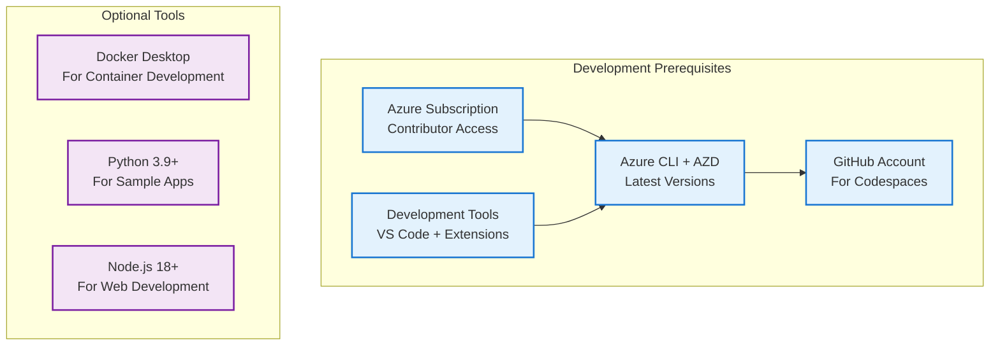
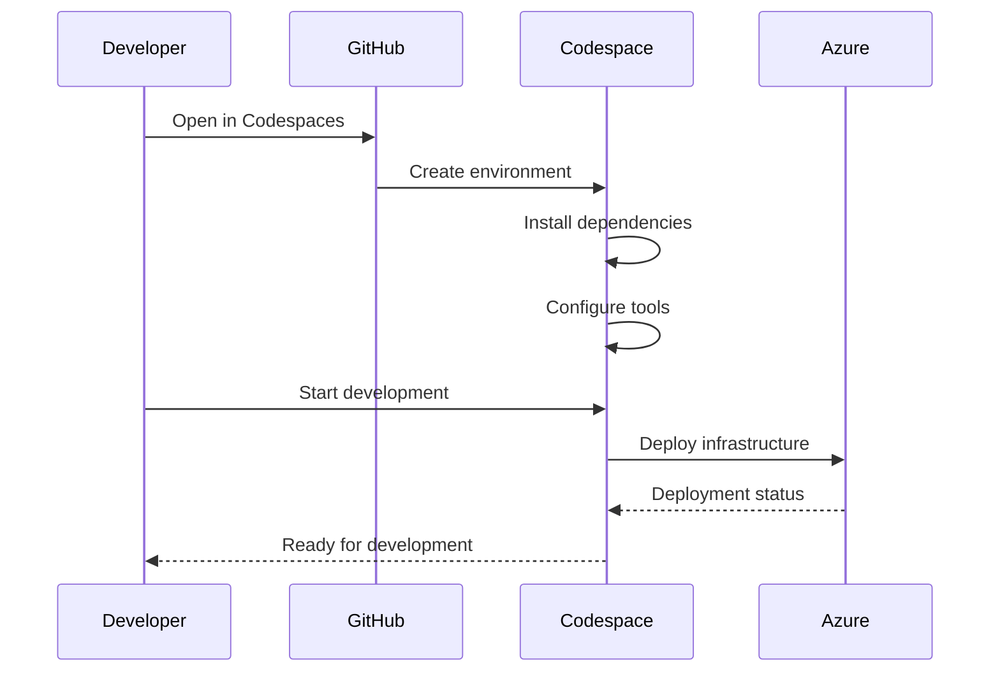
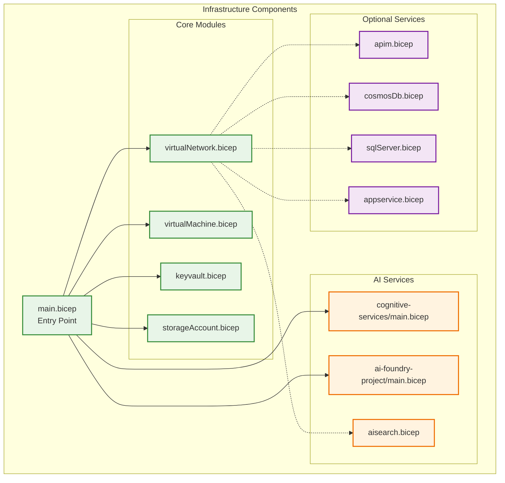
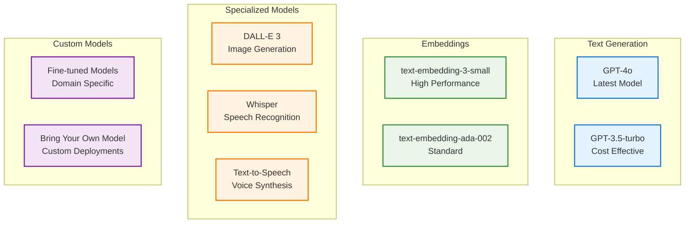
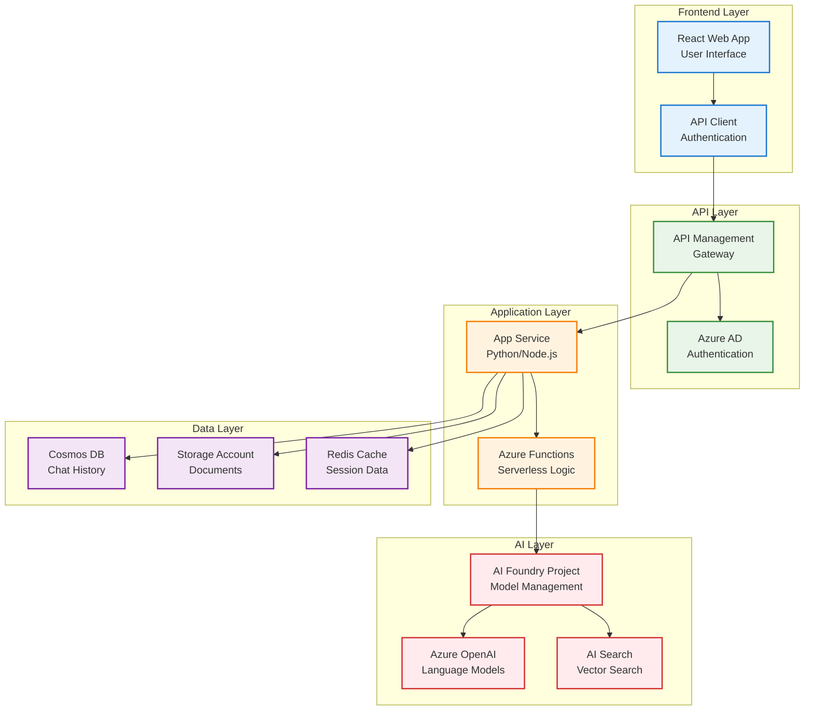
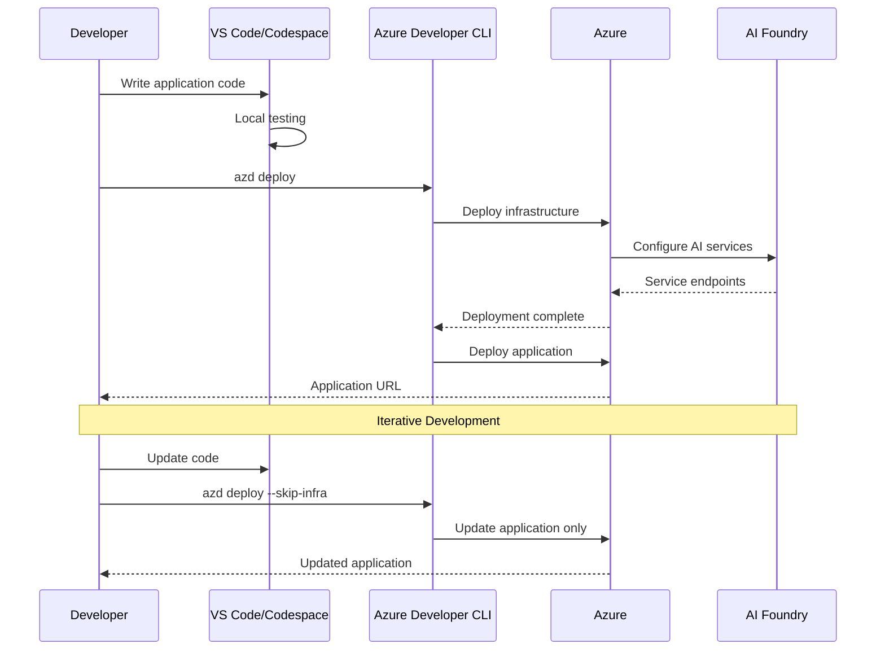
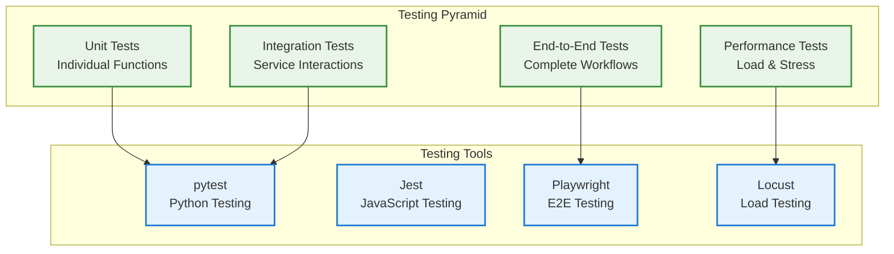
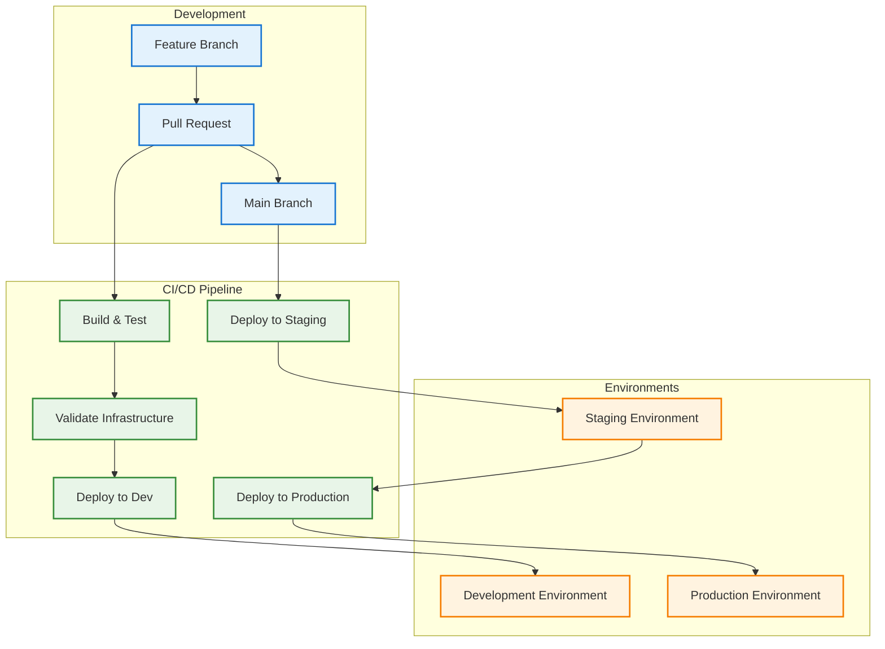
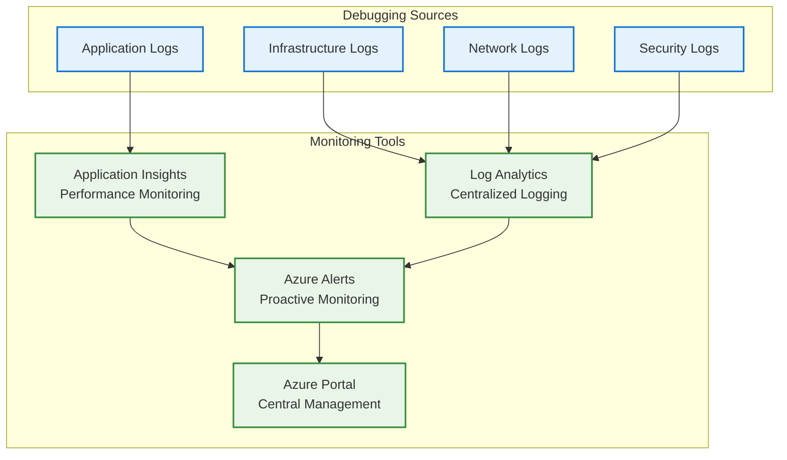

# Developer Guide

## Table of Contents
1. [Getting Started](#getting-started)
2. [Development Environment Setup](#development-environment-setup)
3. [Infrastructure Customization](#infrastructure-customization)
4. [AI Model Configuration](#ai-model-configuration)
5. [Application Development](#application-development)
6. [Testing and Validation](#testing-and-validation)
7. [Deployment Patterns](#deployment-patterns)
8. [Troubleshooting](#troubleshooting)

## Getting Started

### Prerequisites for Developers



### Quick Development Setup

1. **Choose Your Development Environment**:
   - **GitHub Codespaces** (Recommended): Pre-configured environment
   - **Local Development**: Your machine with required tools
   - **Dev Containers**: Consistent containerized environment

2. **Clone and Initialize**:
```bash
git clone https://github.com/Zone-Enterprise/Deploy-Your-AI-Application-In-Production.git
cd Deploy-Your-AI-Application-In-Production
```

3. **Configure Environment**:
```bash
# Initialize Azure Developer CLI
azd auth login
azd init

# Set environment variables
azd env set AZURE_LOCATION "eastus2"
azd env set AZURE_SUBSCRIPTION_ID "your-subscription-id"
```

## Development Environment Setup

### GitHub Codespaces (Recommended)

Codespaces provides a fully configured development environment in the cloud:



**Features**:
- Pre-installed Azure CLI, AZD, and development tools
- Configured VS Code with extensions
- Docker support for containerized development
- Integrated terminal and debugging

### Local Development Environment

Set up your local machine for development:

```bash
# Install Azure CLI
curl -sL https://aka.ms/InstallAzureCLIDeb | sudo bash

# Install Azure Developer CLI
curl -fsSL https://aka.ms/install-azd.sh | bash

# Install VS Code extensions
code --install-extension ms-vscode.vscode-bicep
code --install-extension ms-azure-devops.azure-devops
code --install-extension ms-vscode.azure-account
```

### Development Container

Use the provided dev container for consistent environment:

```json
// .devcontainer/devcontainer.json
{
    "name": "AI Foundry Development",
    "image": "mcr.microsoft.com/devcontainers/universal:latest",
    "features": {
        "ghcr.io/devcontainers/features/azure-cli:1": {},
        "ghcr.io/azure/azure-dev-cli/azd:latest": {}
    },
    "customizations": {
        "vscode": {
            "extensions": [
                "ms-vscode.vscode-bicep",
                "ms-azure-devops.azure-devops"
            ]
        }
    }
}
```

## Infrastructure Customization

### Bicep Template Structure



### Key Configuration Files

| File | Purpose | Customization Options |
|------|---------|----------------------|
| `main.bicep` | Primary template | Resource naming, feature flags |
| `main.parameters.json` | Deployment parameters | Environment-specific values |
| `azure.yaml` | AZD configuration | Deployment hooks, environment settings |

### Common Customizations

#### 1. Adding Custom AI Models

```bicep
// In main.bicep
param customModelDeployments modelDeploymentType[] = [
  {
    name: 'custom-gpt-4'
    modelName: 'gpt-4'
    version: '0613'
    capacity: 50
  }
]
```

#### 2. Custom Network Configuration

```bicep
// Custom subnet configuration
param customSubnets array = [
  {
    name: 'snet-custom-app'
    addressPrefix: '10.0.3.0/24'
    networkSecurityGroupId: customAppNsg.outputs.resourceId
  }
]
```

#### 3. Additional Storage Accounts

```bicep
// Add specialized storage
module dataLakeStorage 'modules/storageAccount.bicep' = {
  name: 'data-lake-storage'
  params: {
    storageName: 'stdl${sanitizedName}${resourceToken}'
    kind: 'StorageV2'
    sku: 'Standard_LRS'
    isHnsEnabled: true  // Data Lake Gen2
  }
}
```

## AI Model Configuration

### Supported AI Models



### Model Deployment Configuration

```bicep
// Define AI model deployments
var aiModelDeployments = [
  {
    name: 'gpt-4o'
    model: {
      name: 'gpt-4o'
      version: '2024-05-13'
      format: 'OpenAI'
    }
    sku: {
      name: 'GlobalStandard'
      capacity: 150
    }
  }
  {
    name: 'text-embedding-3-small'
    model: {
      name: 'text-embedding-3-small'
      version: '1'
      format: 'OpenAI'
    }
    sku: {
      name: 'GlobalStandard'
      capacity: 100
    }
  }
]
```

### Quota Management

Before deploying, check quota availability:

```bash
# Check current quota usage
az cognitiveservices usage list --location "eastus2"

# Request quota increase
az cognitiveservices account create \
  --name "quota-check" \
  --resource-group "temp-rg" \
  --kind "OpenAI" \
  --sku "S0" \
  --location "eastus2" \
  --custom-domain "quota-check-$(date +%s)"
```

## Application Development

### Sample Application Architecture



### Development Workflow



### Code Structure

```
src/
├── backend/
│   ├── app.py                 # Main application
│   ├── models/                # Data models
│   ├── services/              # Business logic
│   ├── api/                   # API endpoints
│   └── utils/                 # Utilities
├── frontend/
│   ├── src/
│   │   ├── components/        # React components
│   │   ├── services/          # API services
│   │   ├── utils/             # Utilities
│   │   └── App.js             # Main app
│   └── public/
└── shared/
    ├── models/                # Shared data models
    └── constants/             # Constants
```

### Environment Configuration

```python
# app.py - Environment configuration
import os
from azure.identity import DefaultAzureCredential
from azure.keyvault.secrets import SecretClient

class Config:
    def __init__(self):
        self.credential = DefaultAzureCredential()
        self.key_vault_url = os.getenv("AZURE_KEY_VAULT_URL")
        self.secret_client = SecretClient(
            vault_url=self.key_vault_url,
            credential=self.credential
        )
    
    def get_secret(self, secret_name):
        return self.secret_client.get_secret(secret_name).value
    
    @property
    def openai_endpoint(self):
        return self.get_secret("openai-endpoint")
    
    @property
    def search_endpoint(self):
        return self.get_secret("search-endpoint")
```

## Testing and Validation

### Testing Strategy



### Infrastructure Testing

```bash
# Test infrastructure deployment
azd provision --dry-run

# Validate Bicep templates
az bicep build --file infra/main.bicep

# Test with Azure Resource Manager What-If
az deployment group what-if \
  --resource-group "test-rg" \
  --template-file "infra/main.bicep" \
  --parameters "@infra/main.parameters.json"
```

### Application Testing

```python
# test_ai_service.py
import pytest
from services.ai_service import AIService

class TestAIService:
    def setup_method(self):
        self.ai_service = AIService()
    
    def test_generate_response(self):
        prompt = "Hello, how are you?"
        response = self.ai_service.generate_response(prompt)
        assert response is not None
        assert len(response) > 0
    
    def test_search_documents(self):
        query = "AI deployment best practices"
        results = self.ai_service.search_documents(query)
        assert isinstance(results, list)
        assert len(results) > 0
```

### Security Testing

```bash
# Network security validation
nmap -sS -O target-ip-range

# SSL/TLS certificate validation
openssl s_client -connect your-app.azurewebsites.net:443

# Authentication testing
curl -H "Authorization: Bearer invalid-token" \
     https://your-api.azure-api.net/api/chat
```

## Deployment Patterns

### GitOps Deployment Flow



### Environment Configuration

```yaml
# azure.yaml - Multi-environment configuration
name: ai-foundry-app
services:
  backend:
    project: ./src/backend
    language: python
    host: appservice
  frontend:
    project: ./src/frontend
    language: js
    host: staticwebapp

environments:
  development:
    location: eastus2
    parameters:
      networkIsolation: false
      vmSize: Standard_B2s
  
  staging:
    location: eastus2
    parameters:
      networkIsolation: true
      vmSize: Standard_D2s_v3
  
  production:
    location: eastus2
    parameters:
      networkIsolation: true
      vmSize: Standard_D4s_v3
      redundancy: enabled
```

### Blue-Green Deployment

```bash
# Deploy to staging slot
azd deploy --environment staging

# Test staging deployment
./scripts/test-deployment.sh staging

# Swap to production
az webapp deployment slot swap \
  --name myapp \
  --resource-group myrg \
  --slot staging
```

## Troubleshooting

### Common Issues and Solutions

#### 1. Deployment Failures

```bash
# Check deployment status
az deployment group show \
  --resource-group "your-rg" \
  --name "main"

# View deployment logs
az monitor activity-log list \
  --resource-group "your-rg" \
  --offset 1h
```

#### 2. Network Connectivity Issues

```bash
# Test private endpoint connectivity
nslookup your-service.privatelink.openai.azure.com

# Check network security group rules
az network nsg rule list \
  --resource-group "your-rg" \
  --nsg-name "default-nsg"
```

#### 3. AI Service Authentication

```python
# Debug authentication issues
from azure.identity import DefaultAzureCredential
from azure.core.exceptions import ClientAuthenticationError

try:
    credential = DefaultAzureCredential()
    token = credential.get_token("https://cognitiveservices.azure.com/.default")
    print(f"Token acquired: {token.token[:20]}...")
except ClientAuthenticationError as e:
    print(f"Authentication failed: {e}")
```

### Monitoring and Debugging



### Performance Optimization

#### 1. AI Model Performance

```python
# Implement caching for frequent requests
from functools import lru_cache
import hashlib

class AIService:
    @lru_cache(maxsize=100)
    def get_cached_response(self, prompt_hash):
        # Return cached response if available
        pass
    
    def generate_response(self, prompt):
        prompt_hash = hashlib.md5(prompt.encode()).hexdigest()
        return self.get_cached_response(prompt_hash)
```

#### 2. Database Optimization

```python
# Optimize Cosmos DB queries
from azure.cosmos import CosmosClient

def get_conversation_history(user_id, limit=10):
    query = """
    SELECT TOP @limit c.id, c.message, c.timestamp
    FROM conversations c
    WHERE c.userId = @userId
    ORDER BY c.timestamp DESC
    """
    
    parameters = [
        {"name": "@userId", "value": user_id},
        {"name": "@limit", "value": limit}
    ]
    
    return list(container.query_items(
        query=query,
        parameters=parameters,
        enable_cross_partition_query=True
    ))
```

### Best Practices for Development

1. **Security First**: Always use managed identities and Key Vault for secrets
2. **Monitor Everything**: Implement comprehensive logging and monitoring
3. **Test Thoroughly**: Use automated testing at all levels
4. **Document Changes**: Keep infrastructure and application documentation updated
5. **Version Control**: Use semantic versioning for releases
6. **Environment Parity**: Keep development, staging, and production environments consistent

---

## Next Steps

1. **Start Development**: Use the provided templates and examples
2. **Customize Infrastructure**: Modify Bicep templates for your requirements
3. **Implement Monitoring**: Set up comprehensive monitoring and alerting
4. **Security Review**: Conduct security assessment and implement hardening
5. **Performance Testing**: Test under expected load conditions
6. **Production Deployment**: Follow deployment best practices for production

For additional support, refer to the [Technical Architecture Documentation](TECHNICAL_ARCHITECTURE.md) and [community resources](../README.md#community--support).