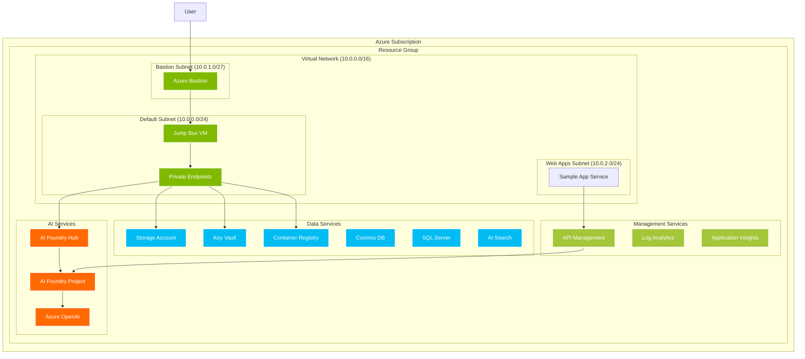
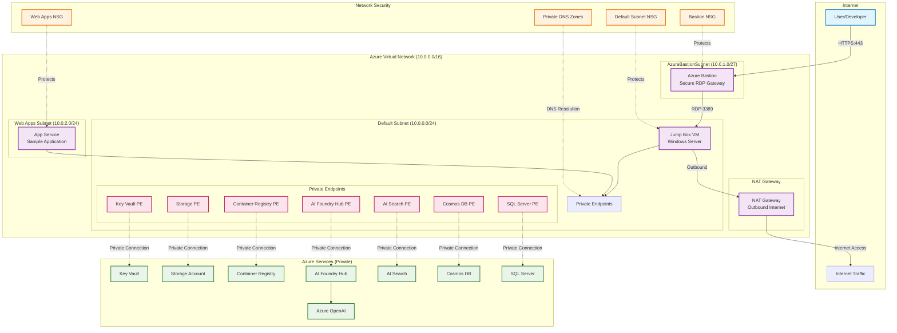
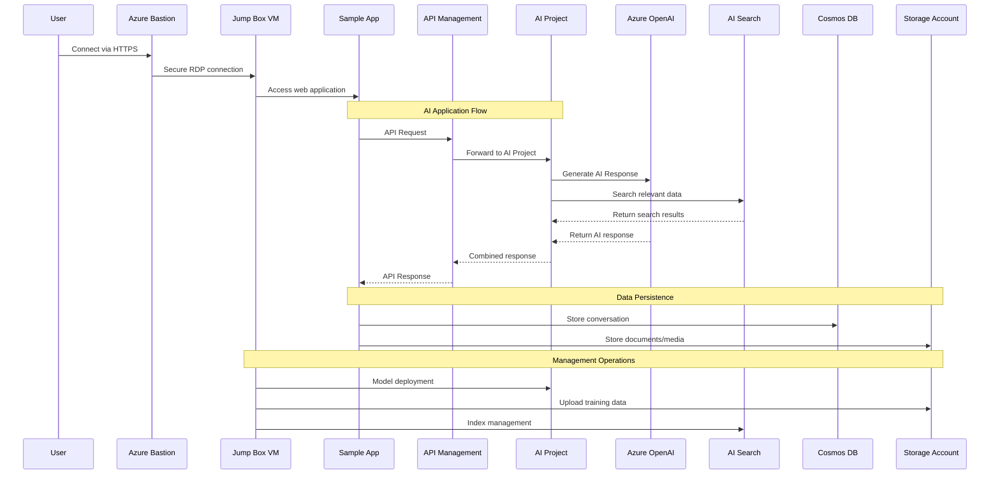
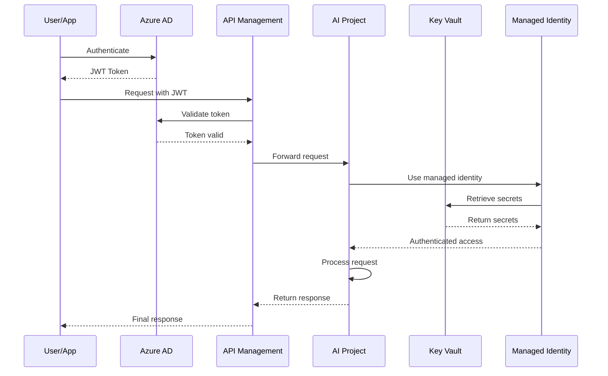
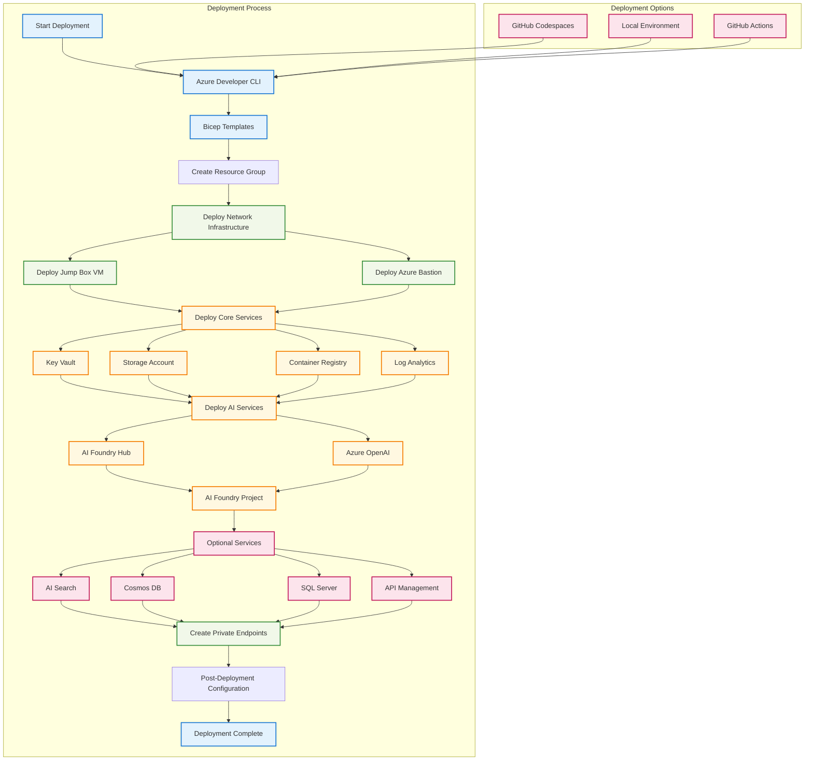
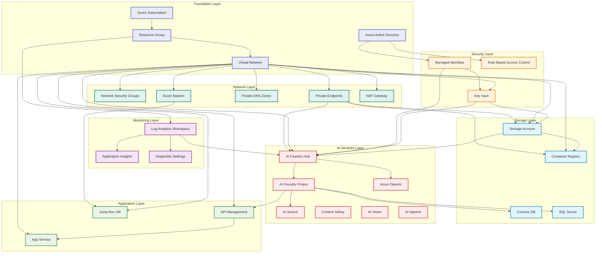
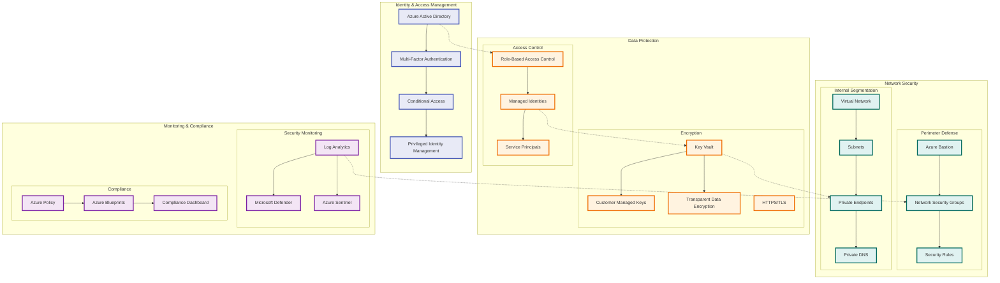
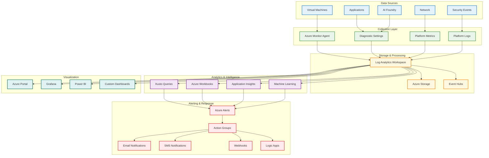

# Technical Architecture Documentation

## Table of Contents
1. [System Overview](#system-overview)
2. [Network Architecture](#network-architecture)
3. [Data Flow](#data-flow)
4. [Deployment Architecture](#deployment-architecture)
5. [Service Dependencies](#service-dependencies)
6. [Security Architecture](#security-architecture)
7. [Monitoring and Observability](#monitoring-and-observability)
8. [Infrastructure Components](#infrastructure-components)

## System Overview

This solution provides a production-ready, secure deployment of Azure AI Foundry with comprehensive network isolation and monitoring capabilities.

## Network Architecture

The solution implements a hub-and-spoke network architecture with complete network isolation using private endpoints.

## Data Flow

### AI Application Data Flow

### Authentication and Authorization Flow

## Deployment Architecture

### Infrastructure Deployment Flow

## Service Dependencies

### Core Service Dependencies

## Security Architecture

### Zero Trust Network Architecture

## Monitoring and Observability

### Monitoring Architecture

## Infrastructure Components

### Core Infrastructure Components

| Component | Purpose | Configuration |
|-----------|---------|---------------|
| **Virtual Network** | Network isolation and segmentation | 10.0.0.0/16 address space |
| **Azure Bastion** | Secure RDP/SSH access | Deployed in dedicated subnet |
| **Jump Box VM** | Secure access to private resources | Windows Server with tools |
| **Private Endpoints** | Secure connectivity to PaaS services | One per service in default subnet |
| **Network Security Groups** | Network traffic filtering | Applied to each subnet |
| **NAT Gateway** | Outbound internet connectivity | Attached to default subnet |

### AI and Data Services

| Component | Purpose | Configuration |
|-----------|---------|---------------|
| **AI Foundry Hub** | Central hub for AI projects | Network isolated with private endpoint |
| **AI Foundry Project** | Individual AI project workspace | Connected to hub with service connections |
| **Azure OpenAI** | Large language models | GPT-4o and text-embedding-3-small |
| **Azure AI Search** | Cognitive search capabilities | Private endpoint enabled |
| **Cosmos DB** | NoSQL database | Optional, private endpoint enabled |
| **SQL Server** | Relational database | Optional, private endpoint enabled |

### Security and Management

| Component | Purpose | Configuration |
|-----------|---------|---------------|
| **Key Vault** | Secrets and key management | Private endpoint, RBAC enabled |
| **Container Registry** | Container image storage | Premium tier, private endpoint |
| **Storage Account** | File and blob storage | Private endpoint, encryption enabled |
| **Log Analytics** | Centralized logging | All services configured for logging |
| **Application Insights** | Application performance monitoring | Connected to Log Analytics |

### Optional Components

| Component | Purpose | When Deployed |
|-----------|---------|---------------|
| **API Management** | API gateway and management | When apiManagementEnabled = true |
| **App Service** | Sample application hosting | When appSampleEnabled = true |
| **Content Safety** | AI content moderation | When contentSafetyEnabled = true |
| **AI Vision** | Computer vision services | When visionEnabled = true |
| **AI Speech** | Speech services | When speechEnabled = true |
| **Translator** | Translation services | When translatorEnabled = true |
| **Document Intelligence** | Document processing | When documentIntelligenceEnabled = true |

---

## Next Steps

1. Review the [deployment guide](../README.md) for step-by-step instructions
2. Check the [quota requirements](quota_check.md) before deployment
3. Configure [additional services](add_additional_services.md) as needed
4. Follow [post-deployment steps](post_deployment_steps.md) for verification
5. Set up [monitoring and alerting](monitoring_setup.md) for production use

For detailed configuration options and customization, refer to the individual service documentation linked throughout this guide.